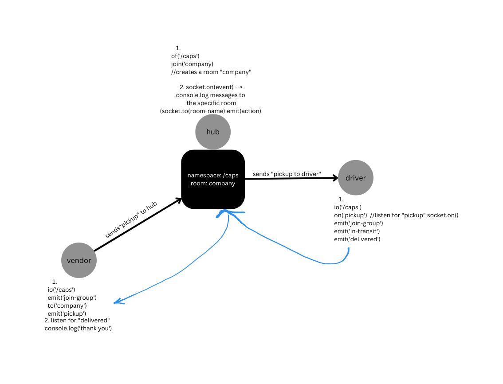

# CAPS

A system that emulates a real world supply chain. CAPS will simulate a delivery service where vendors (such a flower shops) will ship products using our delivery service and when our drivers deliver them, each vendor will be notified that their customers received what they purchased.

Each vendor/driver will be communicating via their own namespace `/caps` and their own channel only within the company, once the driver responds to a pickup event

## Getting Started

1. clone the repo to your local machine and navigate to the folder
2. To start the server: `node hub.js`
3. To get the driver to join the channel `node driver/index.js`
4. To get the vendor to join the channel `node vendor/index.js`

## UML

